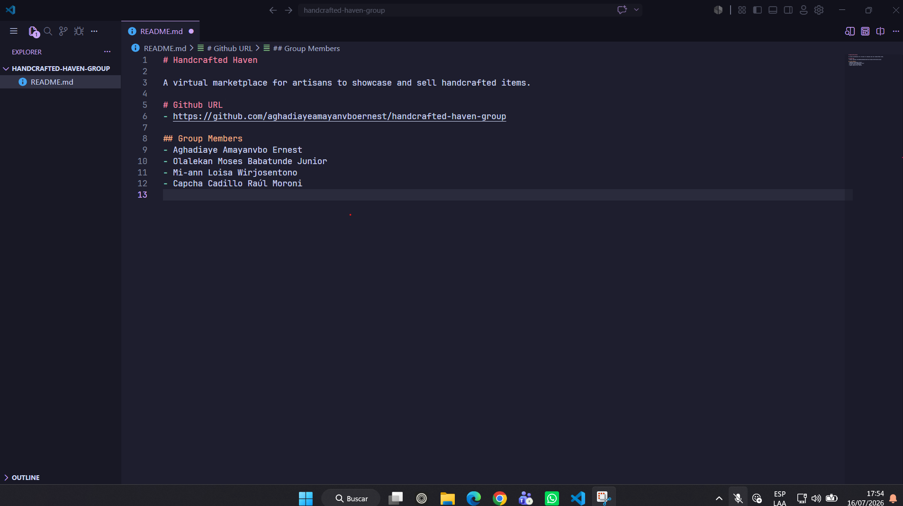

# Handcrafted Haven — Entrega Semana 2 (W02)

## Resumen de la reunión

**Participantes:**
- Aghadiaye Amayanvbo Ernest
- Olalekan Moses Babatunde Junior
- Mi-ann Loisa Wirjosentono
- Capcha Cadillo Raúl Moroni

**Contenido de la reunión:**
El grupo se reunió para revisar el alcance y los requisitos del proyecto **Handcrafted Haven**, un marketplace virtual para que artesanos muestren y vendan sus productos hechos a mano. Se creó el repositorio público en GitHub y el Project asociado con el tablero Kanban. Se agregó a todos los miembros como colaboradores y se redactó el `README.md` con la descripción del proyecto y los nombres del equipo. Cada integrante clonó el repositorio en su máquina local. Además, se inició la lluvia de ideas sobre el esquema de color, tipografía y diseño general del sitio, y se comenzaron a identificar los primeros *user stories* / work items para el tablero del proyecto (mínimo 10). Se seleccionó un nuevo líder de grupo para la siguiente reunión.

---

## URL del repositorio de GitHub

- https://github.com/aghadiayeamayanvboernest/handcrafted-haven-group

---

## Evidencia del diseño del tema

**Propuesta de tema visual — Handcrafted Haven**

- **Paleta de colores:**
  - Terracota — `#C97B4A`
  - Crema — `#F5EFE6`
  - Verde salvia — `#8A9A5B`
  - Marrón oscuro (texto/acentos) — `#4A3B2C`

- **Tipografía:**
  - Títulos: *Playfair Display* (serif cálido)
  - Cuerpo de texto: *Inter* o *Lato* (sans-serif limpio)

- **Layout general:**
  - Diseño tipo grid para tarjetas de productos
  - Header con navegación simple
  - Footer con información del artesano

- **Herramienta usada:** Figma (mockup del tema)

---

## Captura de pantalla del proyecto clonado localmente

*(Insertar aquí la captura de tu proyecto abierto en VS Code, mostrando la ruta local del clon)*

